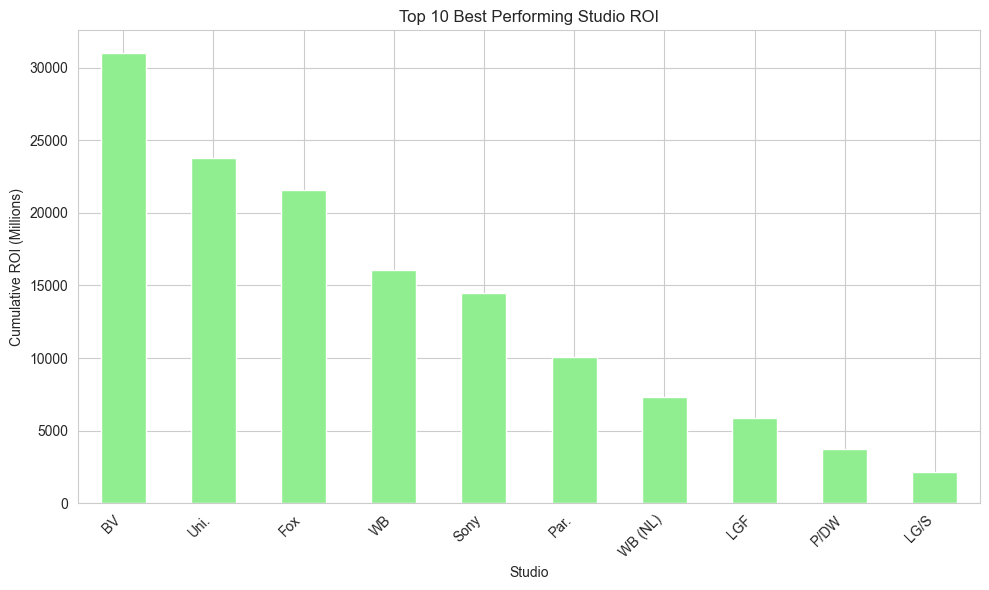
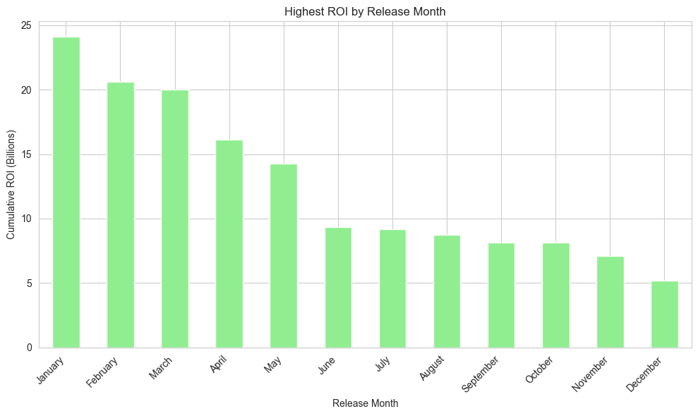

# Determining the Market Segment For Microsoft in the Movie Industry

---

**Author** : [Matthew Karani](mailto:mkmkarani@gmail.com)

## Project Overview

---

This project aims to explore the opportunities of the well-known tech giant, Microsoft , claiming a stake in the lucrative movie industry. This project will use datasets from box office, tmdb and the numbers databases , to analyse the trends in the movie industry to determine the best course of action that Microsoft should take in order to make a big entry into the movie industry as it is fitting for a company of its stature.

## Business Problem

---

Microsoft sees all the big companies creating original video content and they want to get in on the fun. They have decided to create a new movie studio, but they don’t know anything about creating movies. You are charged with exploring what types of films are currently doing the best at the box office. You must then translate those findings into actionable insights that the head of Microsoft's new movie studio can use to help decide what type of films to create.

## Research Questions

1. Which movie studio should microsoft patner with , learn from and leverage its association with in order to get maximum return on investment?
 

2.  What Genre of movies should Microsoft create in order to capture a niche in the market for maximum return on investment. 
 

3. What length of movies would microsoft develop to curve a niche for themselves in the movie industy market in order to get large profits?

# Results

1. This Visualization shows the best performing studion in terms
    of return on investments. 

2. This Visualization shows the movie genres that bring in the 
   highest return on investment.

3. This Visualization shows the Release Months that perform extremely well in terms of ganering the highest return on
   investment.

# Recommendations

1. Microsoft should partner with movie studios such as Buena Vista, Universal Studios and Fox Studios. By partnering with them , they will be able to gain more traction for their movies.

2. Microsoft should focus on creating movies that are mostly in the Adventure genre, but they can venture into action ,comedy as well, so as to generate maximum return on investments.

3. Microsoft should focus on releasing their movies in the months of January, February and March so as to garner the highest return on investments